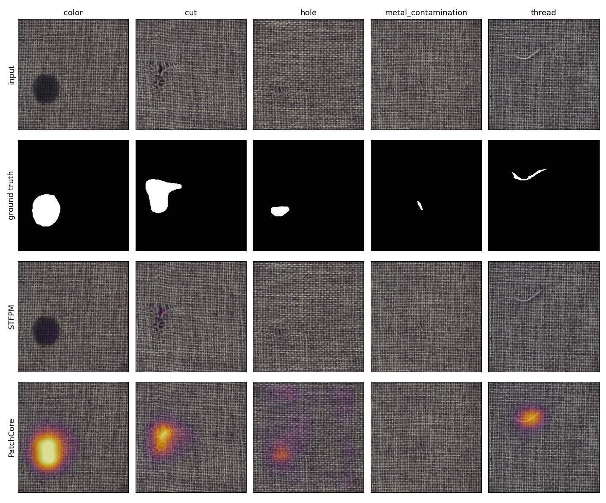
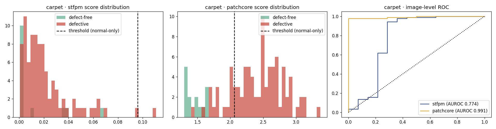
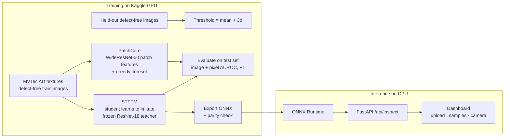

# LoomGuard

**Fabric defect detection that learns from defect-free cloth only.**

Textile mills inspect fabric for holes, cuts, stains and broken threads, mostly by eye. Training a normal classifier for this needs thousands of labeled defect photos, and a mill rarely has them: defects are rare, and every new fabric brings new kinds of defects. LoomGuard sidesteps that. It learns what good fabric looks like, flags anything that doesn't, and shows *where* with a heatmap, all on an ordinary CPU.

> Live demo: _add your Hugging Face Space URL here_ · Training notebook: _add your Kaggle notebook URL here_

<!-- Add a screen recording of the dashboard here: docs/demo.gif -->

## What it does

- **Unsupervised anomaly detection.** Models are trained on defect-free images only. Defect labels are used solely to measure performance, never to train or tune.
- **Pixel-level localisation.** Every inspection returns a heatmap and a bounding box around the abnormal region.
- **Honest thresholds.** The pass/defect threshold is set from a few *defect-free* images captured at deployment time (mean + 3σ of their scores), which is what a factory could actually do. Calibrating on held-out training images instead caused up to 71% false alarms, because normal images drift between training and deployment; the notebook documents this. Many benchmarks pick the threshold using test labels; this project reports that "oracle" number separately.
- **Two models, one trade-off.** A student–teacher network (STFPM, deployed) is compared with PatchCore (memory-bank reference) on accuracy and CPU speed.
- **CPU deployment.** The deployed model is exported to ONNX, verified against PyTorch, and served by FastAPI with a dashboard that accepts uploads, sample images or a live camera feed.

## Results

<!-- RESULTS:START -->
| Category | Model | Image AUROC | Pixel AUROC | F1 (label-free threshold) | False alarms | GPU ms | CPU ms |
|---|---|---|---|---|---|---|---|
| carpet | STFPM (deployed, ONNX) | 0.774 | 0.982 | 0.022 | 0.0% | 4.2 | 37.9 |
| carpet | PatchCore | 0.991 | 0.989 | 0.901 | 0.0% | 39.4 | 739.5 |
| grid | STFPM (deployed, ONNX) | 0.959 | 0.982 | 0.860 | 0.0% | 4.9 | 38.6 |
| grid | PatchCore | 0.987 | 0.978 | 0.825 | 0.0% | 37.4 | 723.7 |
| leather | STFPM (deployed, ONNX) | 0.922 | 0.986 | 0.843 | 0.0% | 4.3 | 38.5 |
| leather | PatchCore | 1.000 | 0.992 | 1.000 | 0.0% | 34.9 | 677.5 |
| tile | STFPM (deployed, ONNX) | 0.999 | 0.959 | 0.994 | 5.9% | 4.6 | 36.4 |
| tile | PatchCore | 0.999 | 0.955 | 0.994 | 5.9% | 33.5 | 629.3 |
| wood | STFPM (deployed, ONNX) | 1.000 | 0.946 | 0.992 | 0.0% | 4.5 | 39.8 |
| wood | PatchCore | 0.993 | 0.932 | 0.899 | 0.0% | 35.3 | 720.3 |
| **mean** | STFPM (deployed, ONNX) | 0.931 | 0.971 | 0.742 | 1.2% | 4.5 | 38.3 |
| **mean** | PatchCore | 0.994 | 0.969 | 0.924 | 1.2% | 36.1 | 698.1 |

Thresholds use no defect labels (mean + 3.0 std of deployment-time defect-free images (half of the test-set good images, excluded from evaluation)). Image score: mean of top 1% pixels. GPU: Tesla T4. CPU timings: Kaggle CPU, 4 threads, batch size 1, STFPM through ONNX Runtime and PatchCore in PyTorch.

**Where STFPM falls short.** On carpet, STFPM still localises defects well (pixel AUROC 0.982) but its image-level scores separate good and defective images poorly (image AUROC 0.774), so the label-free threshold misses most defects. PatchCore reaches 0.991 there, at ~18x the CPU cost. So the app routes carpet to a PatchCore ONNX model (`notebooks/loomguard_carpet_patchcore.ipynb`, 1% coreset, calibrated and evaluated through the exported ONNX itself) and keeps the fast STFPM model for the other textures.




<!-- RESULTS:END -->

## How it works



**STFPM** (Wang et al., 2021). A ResNet-18 pretrained on ImageNet acts as a frozen teacher. A second, randomly initialised ResNet-18 (the student) is trained to reproduce the teacher's feature maps at three scales, but only on defect-free fabric. On a defect, the student has never seen anything similar and its features diverge from the teacher's. The per-pixel divergence, multiplied across scales and smoothed, is the anomaly map; its maximum is the image score.

**PatchCore** (Roth et al., 2022). Patch features from a pretrained WideResNet-50 are stored in a memory bank, reduced to 10% with greedy k-center coreset sampling. A test patch's anomaly score is its distance to the nearest stored patch. It needs no training at all, but nearest-neighbour search against a large bank is slow on a CPU.

## Repository layout

```
notebooks/loomguard_kaggle.ipynb   training, evaluation, ONNX export (runs on Kaggle GPU)
notebooks/loomguard_carpet_patchcore.ipynb   PatchCore ONNX export for carpet (model routing)
app/inference.py                   ONNX Runtime inference, heatmap rendering
app/server.py                      FastAPI service
app/static/index.html              inspection dashboard (no build step)
tools/fill_readme.py               writes your Kaggle numbers into this README
tests/                             unit and API tests
models/ samples/ figures/          filled from the Kaggle output zip
deploy/HF_SPACE.md                 free hosting on Hugging Face Spaces
```

## Reproduce

**1. Train on Kaggle.** Upload `notebooks/loomguard_kaggle.ipynb` to Kaggle, set the accelerator to GPU, turn internet on, add the MVTec AD dataset as input and *Run All* (about 45–60 minutes). Download `loomguard_artifacts.zip` from the Output panel.

**2. Add the results to the repo.**

```powershell
# Windows: replaces old results with the newest *artifacts*.zip in Downloads and refreshes the README
powershell -ExecutionPolicy Bypass -File tools\update_results.ps1
```

On macOS or Linux: `unzip loomguard_artifacts.zip -d . && python tools/fill_readme.py`.

**3. Run the dashboard.**

```bash
pip install -r app/requirements.txt
uvicorn app.server:app --port 8000        # open http://localhost:8000
```

Or with Docker: `docker build -t loomguard . && docker run -p 7860:7860 loomguard`.

**4. Test.** `pip install -r requirements-dev.txt && pytest`

## API

`POST /api/inspect` (multipart: `file`, `category`) returns:

```json
{ "category": "carpet", "score": 0.81, "threshold": 0.54, "severity": 1.5, "is_defect": true,
  "affected_area_pct": 2.3, "bbox": [212, 140, 298, 201], "latency_ms": 41.0,
  "heatmap": "data:image/jpeg;base64,..." }
```

Also: `GET /api/models`, `GET /api/samples?category=`, `GET /api/stats`, `GET /healthz`.

## Design decisions

- **Why anomaly detection instead of classification?** A classifier only recognises defect types it was trained on and needs many labeled examples of each. An anomaly detector needs only good fabric, which a mill produces every day, and it can flag defect types nobody has seen before.
- **Why deploy STFPM rather than the more accurate model?** Inspection runs on a moving line. STFPM's cost is two ResNet-18 forward passes regardless of training-set size, while PatchCore's nearest-neighbour search grows with its memory bank. The results table shows what that accuracy-versus-speed trade costs.
- **Why calibrate on deployment-time defect-free images?** Choosing a threshold with test labels inflates F1 and isn't possible in production. My first version calibrated on held-out *training* images, and carpet got a 71% false-alarm rate: test-time good images score higher than training-session ones. Calibrating on a handful of good samples from the deployment distribution fixed this without using any defect labels. The notebook also reports the oracle F1 so the remaining gap is visible.
- **How is training kept stable?** One early run diverged on carpet (pixel AUROC fell from 0.97 to 0.56) at the paper's learning rate of 0.4. Training now uses gradient clipping, a one-cycle LR schedule, a guard against non-finite losses, and two restarts per category; the run kept is the one with the lowest loss on held-out *defect-free* images, so model selection never touches defect labels.
- **Why score an image by its hottest 1% of pixels, not its single hottest pixel?** On fuzzy textures like carpet, single noisy pixels on good images made the max score unreliable (image AUROC 0.60 while pixel AUROC was 0.97). Averaging the top 1% keeps sensitivity to small defects while ignoring isolated noise.
- **Why put normalisation inside the ONNX graph?** The service then needs only resize and scale-to-[0,1], so the training and serving preprocessing cannot drift apart.

## Limitations and next steps

- MVTec AD textures are photographed under controlled lighting. Real looms add motion blur, lighting drift and fabric stretch; the next step is collecting defect-free images from an actual line and fine-tuning the student on them.
- Industrial fabric is usually captured by line-scan cameras as long strips. Tiled inference over strips, with stitched heatmaps, would be needed for full-width rolls.
- The threshold is global per fabric. A slowly adapting threshold (tracking recent normal scores) would handle gradual lighting changes.
- INT8 quantisation of the ONNX model could cut CPU latency further for edge devices such as a Raspberry Pi.

## Resume summary

<!-- RESUME:START -->
- Built **LoomGuard**, an unsupervised surface-defect detector trained only on defect-free images; **97.1%** pixel AUROC and **93.1%** image AUROC across 5 MVTec AD texture categories (fabric, leather, wood, tile, mesh).
- Benchmarked a student–teacher model (STFPM) against PatchCore; deployed STFPM as a **21.2 MB ONNX** model at **38 ms/image on CPU**, **18× faster** than PatchCore.
- Set decision thresholds without any defect labels: **0.84–0.99 F1** with **6% or fewer false alarms** on 4 of 5 textures; routed the remaining texture to PatchCore (per-category model routing) and diagnosed threshold drift and a training divergence along the way.
- Served through FastAPI + ONNX Runtime with a live camera heatmap dashboard; containerised with Docker.
<!-- RESUME:END -->

## Credits and licence

Code: MIT. Dataset: [MVTec AD](https://www.mvtec.com/company/research/datasets/mvtec-ad) (Bergmann et al., CVPR 2019), licensed CC BY-NC-SA 4.0, so the trained weights and sample images are for non-commercial use. Methods: STFPM (Wang et al., 2021) and PatchCore (Roth et al., CVPR 2022), both reimplemented from scratch in PyTorch.
